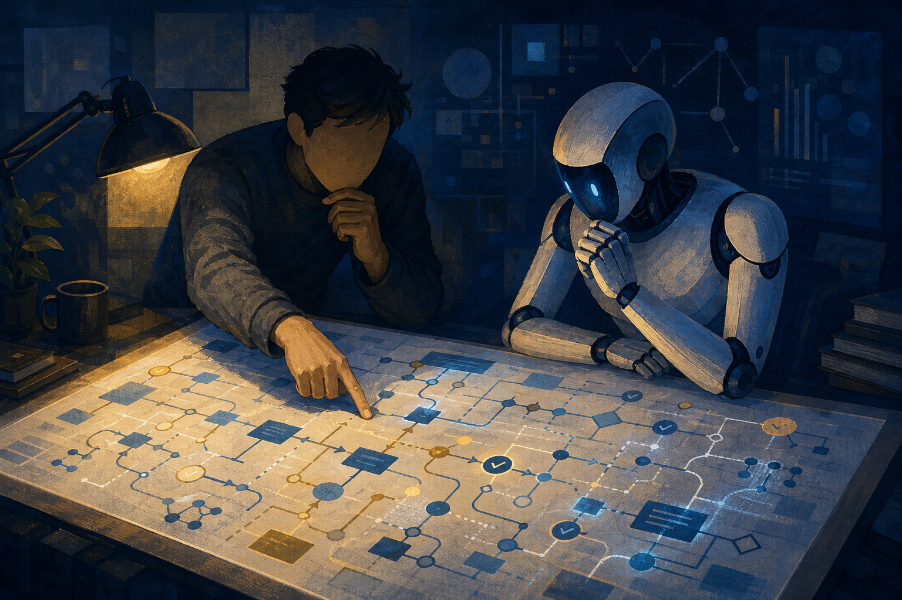

最近有同事推薦我讀 Jocelin 的 [〈我去了一趟世界最大的 AI 工程年會 AI Engineer World's Fair 2026〉](https://doc.jocelinho.com/public/aiewf-2026/)。看完之後其實蠻有感的。

這半年我從原本比較像是在用 Copilot，到現在開始真的用 coding agent 來做專案，中間工具和模型一直變，自己做事的方式也變很多。看這篇文章的時候，裡面不少人講的東西剛好戳到我，所以想趁這個機會，把自己這半年、甚至快一年的 AI coding 經驗整理一下。

## 從 Copilot 到真的把 AI 放進開發流程

一開始我用 AI，大概就是大家熟悉的 Copilot 用法：補一小段 code、問錯誤、請它幫我生一些懶得寫的樣板。

後來開始用 coding agent 之後，事情就不太一樣了。現在可以叫它讀 repository、理解目前的架構、拆工作、改檔案、跑測試。模型也一代一代變得更強，能做的事情真的比半年前多很多。

老實講，這個變化讓我最直接的感受不是「我寫 code 變多快」，而是以前很多只敢想、不太敢真的開工的東西，現在有機會先做出一個能跑的版本。

Jocelin 在文章裡提到 Theo Browne 的一個分享。他用一個很有趣的方式重新標定 AI 時代的工作量：以前做一個 Reddit scraper，可能是一個週末 side project；但現在很多原本覺得很大的東西，也許已經可以先用一份 Markdown 文件把想法講清楚，再叫 agent 慢慢做出來。

這件事我真的很有感。以前如果我想做一個比較完整的系統，可能會先想到要幾個人、要花多久、我到底會不會做。現在至少可以先把東西做出來，再來面對真正的問題。

## Context、Harness 和 Loop

這半年也一直看到一些新的說法：context engineering、harness engineering，還有最近大家開始談的 loop engineering。

一開始看這些詞會覺得又是 AI 圈在發明新名詞，但我自己接觸下來，覺得它們其實都在處理同一件事：**怎麼讓 AI 更好理解我們正在做的專案、它的架構，以及它這次到底該怎麼做。**

Context engineering 講的是怎麼把對的資訊給 AI。不是把整個 repository 一股腦塞進去，而是讓它知道這個功能的背景、目前的限制、相關檔案和既有決定。

Harness engineering 比較像是幫 AI 準備好工作環境。有哪些 command 可以跑、測試怎麼驗證、規則放在哪裡、出了問題可以怎麼回頭檢查。這些東西不一定會直接多一個功能，但能讓 AI 不要每次都像第一次進專案一樣亂撞。

而 loop engineering 對我來說，則比較像是不要期待 AI 一次就把事情做完，而是把工作拆成小一點的 loop：先改一小段、跑測試、看結果、補 context，再做下一步。

Jocelin 的文章裡也整理了不少關於 harness 和 loop 的討論。現場有一派相信可以讓 agent 一直 loop，最後只看 outcome；但也有人提醒，模型和 context 都有極限，loop 只會把錯的方向加速得更快。

我現在還沒有能力說哪一套才是答案，但這些東西讓我開始理解：AI coding 不只是下 prompt 然後等結果。很多時候，真正的工作是把整個專案的架構和限制整理好，讓 AI 能理解，也讓自己不會跟丟。

## 做 NOJV 的這半年

我現在在做的 Online Judge 專案叫做 NOJV，它準備開始進 alpha 測試，但從寒假一路做到暑假，整整花了半年。

單看進度的話，其實很慢。以前我可能會想說，AI 都這麼強了，為什麼一個專案還可以做這麼久？

但回頭看，我這半年不只是在疊功能而已。

我也在慢慢理解資料怎麼流、服務要怎麼切、infra 為什麼要這樣設計，一個功能放進既有系統後會影響到哪裡。以前我比較常想的是「這段 code 能不能寫出來」；現在更多時候會卡在「這個系統到底為什麼要長這樣？如果之後要改，會牽動到什麼？」

這些東西我現在還是在學，而且老實說很多地方還不太懂。但 AI 讓我有機會真的去碰以前不太敢碰的問題。不是它幫我把所有事情做完，而是它讓我能先把東西做出來，再從真的 code、真的錯誤、真的部署和真的使用流程裡面慢慢學。

## Review 不只是抓 AI 有沒有寫錯

這篇文章裡我最有感的部分，還是 Jocelin 整理的 **understanding**。

文章提到 Notion 的 Geoffrey Litt 有一場 talk 叫做〈Understanding is the New Bottleneck〉。他談的重點是，理解會變成瓶頸，但人還是得理解自己在做什麼。理解不只是為了檢查 AI 有沒有錯，而是為了讓自己下一輪還能參與。

這個說法我覺得很重要。

因為如果今天 AI 做完一個功能，我只是在 PR 上面看一看，覺得好像沒問題就按同意，那我可能短期會很快；但等到下一次需求改了，或者系統出問題了，我可能根本不知道自己要從哪裡開始看。

Jocelin 在文章裡也提到，Anthropic 的 Mike Krieger 分享過他們現在還是被 review 卡住，尤其是碰到 infra 的 code。Anthropic 的做法不是叫人逐行檢查 AI 生出來的 diff，而是讓 AI 先把這次改動的 intention 和 tradeoff 講清楚，review 變成跟 AI 討論這次改動到底合不合理。

我覺得這個方向很值得記住。人還是要 review，但 review 不一定是逐行抓錯；更重要的是要知道這個改動在做什麼、為什麼這樣做，以及它放進整個系統之後會發生什麼事。

## 如果我只是一直按同意呢？

文章裡 Addy Osmani 也提到幾個我覺得蠻可怕的詞：Cognitive Debt、Cognitive Surrender 和 Orchestration Tax。

Cognitive Debt 是指，我們對問題怎麼被解決的理解會慢慢流失。今天 merge 了一個自己講不出來在做什麼的 PR，可能當下沒事；但幾個月後，就會變成看不懂的系統。

Cognitive Surrender 更直接，就是 AI 說什麼都好，自己不再思考。這大概也是我最不希望自己變成的樣子。

我其實蠻好奇，如果這半年每一次 AI 提出方案，我都只是一路按同意，今天的我會變成什麼樣子？

也許產品還是做得出來，甚至短期看起來會更快。但我可能還是半年前那個只會處理局部題目、面對大型專案卻不知道從哪裡開始的人。等到需求變複雜、不同方案打架，或系統開始出問題，我可能沒有能力判斷，也沒有能力帶著 AI 往下一步走。

這不是說每一行 code 都要自己寫，或每一次都一定要比 AI 懂。比較像是，我希望自己至少不要把方向盤直接交出去。

## AI 對我來說也是一種學習方式

加入 NYCU Life、接觸更多專案之後，我覺得 AI 不只是幫我把事情做快。

它讓我更有機會去做以前畫過的餅，也讓我更容易碰到系統層面、架構層面的問題。以前很多東西我可能只會停在「這好像很酷」，現在可以真的做一版出來，然後才發現原來資料庫、網路、部署、權限、測試，還有一堆事情都要慢慢補。

這其實也是一種學習。

Jocelin 在文章裡提到 AIEWF 現場有「lights-off」和「human-in-the-loop」兩邊的討論：一邊相信未來人類只看結果，讓 agent 自己跑；另一邊認為人還是要留在迴圈裡，知道 agent 做了什麼。

我現在大概比較靠近後者。不是因為我覺得 AI 不夠強，而是我還想繼續學，也還想繼續參與我做的專案。

## 給自己接下來一年的期許

我不敢說未來工程師會不會被淘汰，也不覺得自己現在有資格替這件事下結論。

但我希望自己不要只停在「會寫 code」這件事上。

寫 code 當然還是重要的技能，可是當 AI 讓實作越來越快，我覺得自己更需要補的是系統、架構、domain knowledge，還有知道一個東西為什麼要這樣做的能力。

我希望自己能在研究所剩下的一年裡（希望啦，畢竟我也不確定一年能不能畢業），多理解一點 Computer Science、多理解一點系統，也多理解自己到底在做什麼。

希望下一次我想做一個看起來很大的專案時，不只是因為 AI 讓我有能力把它做出來；而是我能更清楚地說出它的架構、知道它為什麼這樣設計、看得見它接下來可能會遇到什麼問題，然後更熟練地使用 AI 去把它做出來。

AI 一直在變強，我也希望自己不要停下來。
