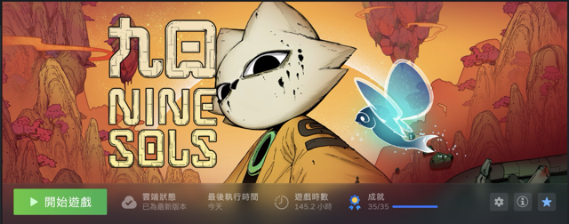
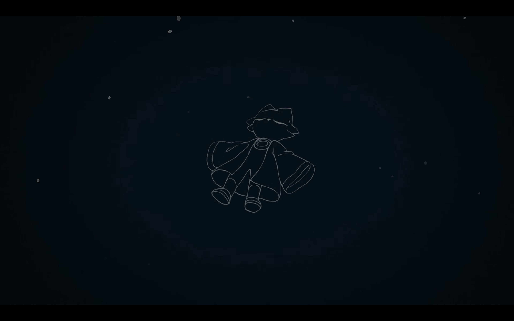

## 前言
九日，是我從認識赤燭後第一次從頭追蹤遊戲開發到發售的遊戲，之前也有體驗過試玩版。之後正式上市後，甚至還特別在師大黑客松送出了一份，只希望能夠有更多人認識這款遊戲，更甚至說認識赤燭這個團隊。
然而，追蹤歸追蹤，喜歡歸喜歡，玩又是另一回事了，對於一個手殘黨來言，這遊戲過程可以算是折磨？甚至第一次打還直接開了劇情模式，妾身真的打不過啊～～～～
直到二刷真結局時才又嘗試了普通模式，結果就是花 3 倍的時間才打完，但針對喜歡的遊戲，不給他刷個全成就心裡真的會不甘吧？

全成就人權證明

## 九日簡介(copy from steam)
《九日》是一款結合道教科幻與上古神話的 2D 平台動作冒險遊戲。強調格擋機制和節奏明快的戰鬥、配合獨特的道龐克背景，刻畫出別具特色的手繪世界。
跟隨英雄羿的腳步，在新崑崙，羿將踏上一段始於『復仇』，終於『道』的誅王之路。
新崑崙，這座由外星種族太陽人所建造的庇護所數百年間沉靜如海。在這片廣褒的疆域裡，神祇們為凡人留下一處被稱為桃花村的應許之地，亙古以來居住於此的人們持續著古老的祭祀，神聖的儀式會庇佑其子民免於種種災厄。很快地，又一次的祭典即將舉行，村裡的人們正忙著張羅各類祭品。然而就在一切如常之時，一位被遺忘的英雄，羿，從漫長的沉睡中意外甦醒，並在道的洪流掀起巨大漣漪。
跟隨羿的腳步，一起在復仇的路上前行並擊敗統治新崑崙的九王。探索這個道教龐克的世界解開新崑崙神秘的面紗。

## 遊戲
九日的戰鬥系統老實真的十分對我胃口，與其說像是一般的黑魂遊戲，但卻又結合了更多解迷、跑酷的要素，要玩這個遊戲講真的需要的不只是戰鬥技巧，根本是希望玩家能夠通才。
但這也是我覺得這款遊戲的魅力所在，不只是單純的打怪，還有更多的解謎要素，讓我這種手殘黨也能夠玩得開心（嗎？
在戰鬥方面，格檔的銅鑼音效講真的實在過癮，每格擋一下都會有種滿足感（？加上貼符的節奏，你可以說九日是以款真正的音樂遊戲（?
跑酷的部分，由於在試玩版的時候沒體驗到多少，所以在正式版的時候，才真的體會到赤燭的用心，真的十分喜歡芙蝶的跑酷部分，雖然對於手殘黨真的...不堪回首的回憶呢...

## 劇情
赤燭的遊戲，劇情方面一直是品質保證，譬如先前的返校跟還願，劇情都描寫得十分細膩。
每個人物的背景故事、淵源，不免的會讓人希望可以更深入了解整個世界觀，（這邊跪求赤燭快出 DLC 啊～～～
恆的部分...整個故事沒有真實出現在場景中，但卻串起了整個故事，看完根本逼人變妹控吧（醒醒吧你沒有妹妹

## 結語
這算是我第一次把一款遊戲從頭玩到尾，還刷了全成就，真的很喜歡這款遊戲，也很喜歡赤燭的作品。
所以所有人都該給我去玩一遍！！！沒錢我出錢！（沒，我沒錢，我要存錢繼續買赤燭的遊戲（？
希望赤燭可以繼續出更多好玩的遊戲，也希望有更多人可以認識赤燭這個團隊，他們真的很用心在做遊戲，台灣的獨立遊戲團隊直得被更多人認識。
最後附上結尾照（然後珂拉琪的歌真的好好聽啊...

